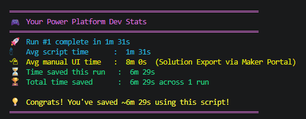
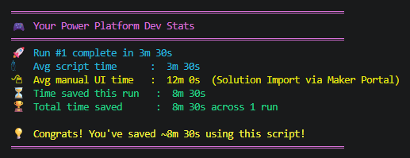

# powerplatform-devtools

  

Interactive PowerShell scripts for managing Power Platform solution deployments via the PAC CLI. Supports exporting, unpacking, packing, and importing solutions across Commercial, GCC, GCC High, and DoD cloud environments.

---

## Overview

This repository contains two standalone PowerShell 7 scripts designed to streamline Power Platform ALM (Application Lifecycle Management) workflows:

| Script | Purpose |
|---|---|
| `download.ps1` | Export a solution from a source environment and optionally unpack it into a source-control-friendly folder structure |
| `deploy.ps1` | Pack an unpacked (or raw-export) solution folder into a `.zip` file and import it into a target environment |
| `run-history.psm1` | Shared module that saves and restores previous run configurations so you can skip re-entering inputs on repeat runs |

Both scripts are fully interactive — they guide you through authentication, environment selection, and all required options at runtime. Parameters are also available for scripted/CI use.

---

## Prerequisites

| Requirement | Details |
|---|---|
| **PowerShell 7.0+** | `pwsh` must be on your PATH. [Download](https://aka.ms/powershell) |
| **PAC CLI** | Power Apps CLI must be installed and on your PATH. [Install guide](https://aka.ms/PowerAppsCLI) |
| **Power Platform role** | System Customizer or System Administrator on the target/source environment |
| **Azure AD / Entra ID account** | Used for interactive browser-based login via PAC auth profiles |

Verify your setup before running:

```powershell
pwsh --version    # 7.0 or higher
pac --version     # any recent version
```

---

## Usage Guide

### download.ps1 — Export a solution

**Fully interactive (recommended for first-time use):**

```powershell
.\tools\download.ps1
```

The script will prompt you to:
1. Select or create a PAC CLI auth profile (browser login)
2. Select the source environment (list or enter a GUID)
3. Select the solution to export (list or enter the unique name)
4. Choose the output `.zip` path
5. Choose Unmanaged or Managed export
6. Optionally unpack the solution into a folder for source control

**With parameters:**

```powershell
# Export only
.\tools\download.ps1 -SolutionName "MySolution" -OutputZip ".\MySolution.zip"

# Export managed solution
.\tools\download.ps1 -SolutionName "MySolution" -OutputZip ".\MySolution_managed.zip" -Managed

# Export and unpack for source control in one step
.\tools\download.ps1 -SolutionName "MySolution" -OutputZip ".\MySolution.zip" -Unpack
```

---

### deploy.ps1 — Pack and import a solution

**Fully interactive:**

```powershell
.\tools\deploy.ps1
```

The script will prompt you to:
1. Select or create a PAC CLI auth profile (browser login)
2. Select the target environment (list or enter a GUID)
3. Provide the path to the solution folder
4. Choose the output `.zip` path
5. Choose publish and overwrite options

**With parameters:**

```powershell
# Pack from an unpacked folder and deploy
.\tools\deploy.ps1 -SolutionFolder ".\MySolution"

# Specify output zip and deploy as managed
.\tools\deploy.ps1 -SolutionFolder ".\MySolution" -OutputZip ".\MySolution.zip" -Managed
```

---

## Configuration

### Script Parameters

#### `download.ps1`

| Parameter | Type | Description |
|---|---|---|
| `-SolutionName` | `string` | Unique name of the solution to export. Prompted interactively if omitted. |
| `-OutputZip` | `string` | Output path for the exported `.zip`. Defaults to `.\<SolutionName>.zip`. |
| `-Managed` | `switch` | Export as a managed solution. Defaults to unmanaged. |
| `-Unpack` | `switch` | Unpack the exported zip into a folder after export. |
| `-NoStats` | `switch` | Suppress the usage stats summary for this run. |

#### `deploy.ps1`

| Parameter | Type | Description |
|---|---|---|
| `-SolutionFolder` | `string` | Path to the unpacked solution folder. Prompted interactively if omitted. |
| `-OutputZip` | `string` | Output path for the packed `.zip`. Defaults to `<SolutionFolder>.zip`. |
| `-Managed` | `switch` | Pack as a managed solution. Defaults to unmanaged. |
| `-NoStats` | `switch` | Suppress the usage stats summary for this run. |

---

## Usage Stats & Gamification

Both scripts include a lightweight, opt-out stats feature that tracks how much time you are saving compared to doing the same action manually through the Maker Portal.

After each successful run you'll see a coloured summary like this:

**download.ps1**



**deploy.ps1**



### What is tracked

| Metric | How it's calculated |
|---|---|
| **Total runs** | Incremented by 1 each execution |
| **Avg script time** | Cumulative runtime ÷ total runs |
| **Avg manual UI time** | Fixed baseline: 8 min (export), 12 min (import) — see assumptions below |
| **Time saved this run** | Manual baseline − this run's elapsed time |
| **Total time saved** | (Baseline × total runs) − cumulative script runtime |

Runtime is captured _before_ the stats block runs, so the display output is never counted in the calculation.

### Storage

Stats are stored as small JSON files in your local user profile:

```
%LOCALAPPDATA%\powerplatform-devtools\download-stats.json
%LOCALAPPDATA%\powerplatform-devtools\deploy-stats.json
```

The directory is created automatically on first run. No data is sent anywhere — everything stays local.

### Disabling the stats feature

The feature is **enabled by default**. To turn it off:

| Method | How |
|---|---|
| **Per-run** | Pass `-NoStats` flag: `.\tools\download.ps1 -NoStats` |
| **Permanently (current session)** | `$env:PPDEVTOOLS_NO_STATS = '1'` |
| **Permanently (all sessions)** | Add `$env:PPDEVTOOLS_NO_STATS = '1'` to your PowerShell profile (`$PROFILE`) |
| **Remove entirely** | Delete the `# ── Gamification / Usage Statistics ──` block and the 3 lines in `main` that reference `$ScriptStartTime`, `$runtimeSec`, and `Show-UsageStats` |

### Manual UI time assumptions

| Script | Baseline | Steps included in estimate |
|---|---|---|
| `download.ps1` | **8 minutes** | Navigate to make.powerapps.com → Solutions → locate solution → Export → choose type → Next → Export → wait → download zip |
| `deploy.ps1` | **12 minutes** | Navigate → Solutions → Import Solution → upload zip → review summary → Next → Import → wait for async job → publish customizations |

These are conservative estimates for a typical mid-size solution. Complex solutions or slow tenants will take longer, so actual savings are usually higher.

---

## Run History

Both scripts remember your last few configurations so you can skip re-entering inputs on repeat runs.

### How it works

1. On each run, after PAC CLI is verified, the script checks for saved configurations that match the current script and solution path.
2. If any non-expired entries exist, a numbered menu is displayed:
   ```
   [1]  2026-05-08 14:30  (2h ago)
         Auth Profile  : PPMF-GCCH-Prod
         Environment   : xxxxxxxx-xxxx-xxxx-xxxx-xxxxxxxxxxxx
         Solution      : MySolution
         Type          : Managed
   ```
3. Select a number to reuse that configuration, or press **Enter** to enter details manually.
4. A confirmation prompt (highlighted in yellow with the Environment ID) must be accepted before execution proceeds.
5. On successful completion, the run is saved to history for next time.

### Storage

History is stored in a single JSON file:

```
%LOCALAPPDATA%\powerplatform-devtools\run-history.json
```

The file is created automatically. It is scoped to the current user's `LOCALAPPDATA` and is never transmitted anywhere.

### Configuration

| Setting | Default | Description |
|---|---|---|
| `ExpiryHours` | `24` | Hours after which a saved entry will not be offered for reuse |
| `MaxEntries` | `10` | Maximum entries retained per script/solution scope |

Change settings at any time using the `Set-RunHistorySettings` function from the module:

```powershell
# Load the module first
Import-Module .\tools\run-history.psm1

# Change expiry to 8 hours and keep only 5 entries per scope
Set-RunHistorySettings -ExpiryHours 8 -MaxEntries 5
```

### Utility functions

| Function | Description |
|---|---|
| `Get-SavedRunHistory` | Returns non-expired entries for a given script/solution scope |
| `Save-RunHistory` | Appends an entry after a successful run (called automatically) |
| `Select-SavedRun` | Interactive menu to pick a previous configuration |
| `Confirm-ReusedRun` | Displays a confirmation summary before executing a reused config |
| `Clear-SavedRunHistory` | Removes history entries — scoped or all |
| `Set-RunHistorySettings` | Updates `ExpiryHours` and `MaxEntries` |

```powershell
Import-Module .\tools\run-history.psm1

# Clear history for deploy.ps1 only
Clear-SavedRunHistory -ScriptType deploy -ScriptPath .\tools\deploy.ps1

# Clear all history for all scripts
Clear-SavedRunHistory -All
```

### Expiry recommendation

The default of **24 hours** covers a full working day. For higher-sensitivity environments, reduce this to `4` or `8` hours. One hour is not recommended — it disrupts workflows where multiple deployments are made across a morning session.

---

### Sovereign Cloud Configuration

Both scripts support sovereign cloud environments via PAC auth profiles. When creating a new profile, select the appropriate cloud:

| Option | PAC CLI Cloud Flag | Use Case |
|---|---|---|
| 1 — Commercial | _(default)_ | Standard commercial tenants |
| 2 — GCC | `UsGov` | US Government Community Cloud |
| 3 — GCC High | `UsGovHigh` | GCC High (ITAR/DoD contractors) |
| 4 — DoD | `UsGovDod` | Department of Defense |

Auth profiles are stored locally by the PAC CLI and persist between sessions. Use `pac auth list` to view saved profiles.

---

## Technical Details

### Authentication Flow

Both scripts use `pac auth` profiles for authentication:
- If profiles already exist, the user is prompted to select one by index.
- If no profiles exist (or the user opts to create a new one), the script calls `pac auth create`, which opens a browser for interactive login.
- Profiles are stored and managed entirely by the PAC CLI, not by these scripts.

### Solution Format Detection (`deploy.ps1`)

`deploy.ps1` auto-detects the format of the solution folder to determine how to pack it:

| Format | Detection Criteria | Pack Method |
|---|---|---|
| **PAC-unpacked** | `Other\Customizations.xml` present | `pac solution pack` |
| **Raw export** | `customizations.xml` at root (maker-portal export) | `Compress-Archive` |

### Typical ALM Workflow

```
Source Environment                     Target Environment
       │                                        │
  download.ps1  ──(export + unpack)──▶  Git repo  ──(pack + import)──▶  deploy.ps1
```

1. Run `download.ps1` to export and unpack the solution from the source environment.
2. Commit the unpacked folder to source control.
3. Run `deploy.ps1` on the unpacked folder to pack and import into the target environment.

---

## Security Considerations

> These scripts were reviewed against the [OWASP Top 10](https://owasp.org/www-project-top-ten/) before publication. The findings and mitigations are documented below.

---

### A01 – Authentication & Credential Handling

- Scripts use **interactive browser-based login** via the PAC CLI's `pac auth create` command. No credentials, tokens, or passwords are accepted as script parameters, stored in variables, or written to disk by these scripts.
- PAC CLI auth profiles (OAuth tokens) are stored in `~/.pac/` by the PAC CLI itself, not by these scripts. Apply appropriate filesystem permissions to that directory.
- Auth profile selection uses the integer index returned by `pac auth list`, not raw user-supplied strings, to avoid profile spoofing.

---

### A03 – Command Injection

All PAC CLI calls use PowerShell's **call operator (`&`) with typed argument arrays** rather than `Invoke-Expression` or inline string interpolation. This ensures user-supplied values (solution names, file paths, profile names, environment IDs) are always passed as literal arguments and never interpreted by a shell parser.

| Function | Script | Mitigation |
|---|---|---|
| `Select-AuthProfile` — `pac auth create` | Both | `& pac @pacArgs` argument array |
| `Select-AuthProfile` — `pac auth select` | Both | Integer index only (`[int]`) |
| `Invoke-Export` — `pac solution export` | `download.ps1` | `& pac @pacArgs` argument array |
| `Invoke-Unpack` — `pac solution unpack` | `download.ps1` | `& pac @pacArgs` argument array |
| `Invoke-Pack` — `pac solution pack` | `deploy.ps1` | `& pac @pacArgs` argument array |
| `Invoke-Deploy` — `pac solution import` | `deploy.ps1` | `& pac @pacArgs` argument array |

> **v1.1.0 fix:** `Invoke-Unpack` (`download.ps1`) and `Invoke-Pack` (`deploy.ps1`) previously used inline splatted arguments for PAC CLI calls with user-supplied paths. Both have been converted to argument arrays to be consistent with the rest of the scripts.
>
> **v1.2.0:** `run-history.psm1` does not make any PAC CLI calls directly. All CLI invocations remain in the main scripts and continue to use argument arrays.

---

### A04 – Path Handling

- Environment IDs (GUIDs) are validated against the pattern `^[0-9a-fA-F\-]{36}$` before being passed to any PAC CLI call.
- Solution folder paths are validated with `Test-Path` and checked for the presence of `solution.xml` or `Other\Solution.xml` before use.
- `$OutputZip` and user-supplied folder paths are **not** canonicalized or checked for path traversal sequences (e.g. `../../`). This is an accepted design constraint — these scripts are intended for use by **trusted local operators only** and are not hardened against adversarial input from untrusted sources.

---

### A05 – Local JSON Storage (Stats & Run History)

Both the gamification feature and the run-history module write small JSON files to `%LOCALAPPDATA%\powerplatform-devtools\`. Key design decisions that limit risk across all three files:

| File | Written by |
|---|---|
| `deploy-stats.json` | `deploy.ps1` |
| `download-stats.json` | `download.ps1` |
| `run-history.json` | `run-history.psm1` |

- **Scope**: All files are written to the current user's `LOCALAPPDATA`, accessible only to that user account under standard Windows filesystem permissions.
- **No secrets stored**: `run-history.json` persists only PAC auth profile names (display labels, not tokens), environment IDs (GUIDs), solution names, and file paths. No passwords, OAuth tokens, or credentials are ever written.
- **Typed reads**: Values read from JSON are immediately cast to typed primitives before use. A tampered or corrupt file yields safe defaults rather than erroring.
- **No execution surface**: File contents are never passed to `Invoke-Expression`, shell commands, or any PAC CLI call as constructed strings.
- **Non-fatal writes**: All file I/O is wrapped in `try/catch`. A failure produces a warning and does not affect the deployment or download outcome.
- **Expiry**: Run history entries expire after `ExpiryHours` (default 24) and are never surfaced to the user after that point. Expired entries are pruned on the next save.

---

### No Secrets in Source Control

The `.gitignore` in this repository excludes PAC auth profiles, `.env` files, credential files, and exported solution `.zip` files. Review `.gitignore` before committing to ensure sensitive artefacts are not accidentally tracked.

---

### Principle of Least Privilege

Use an account with the **minimum required Power Platform role** on each environment:

| Operation | Minimum role |
|---|---|
| Export solution | System Customizer |
| Import solution (unmanaged) | System Customizer |
| Import solution + publish | System Customizer |
| Import managed solution | System Administrator |

Avoid using global admin or tenant admin credentials for routine deployments.

---

### Scope and Limitations

- These scripts are designed for **interactive use by trusted operators on their own machines**. They are not hardened for multi-tenant SaaS scenarios, automated pipelines with untrusted input sources, or use against adversarial environments.
- No network calls are made by the scripts themselves. All Power Platform API communication is handled by the PAC CLI.
- `Set-StrictMode -Version Latest` and `$ErrorActionPreference = 'Stop'` are set at the top of both scripts to surface unhandled errors immediately.

---

### Reporting Issues

If you discover a security concern, please open a GitHub issue or contact the repository maintainers directly rather than posting sensitive details publicly.

---

## AI Disclosure

The scripts, security review, and documentation in this repository were generated with the assistance of **[GitHub Copilot](https://github.com/features/copilot)** (Claude Sonnet 4.6 model, via GitHub Copilot Pro). All output was reviewed by a human before publication.

Users should apply the same due diligence they would to any third-party code — review the scripts before running them in your environment.

---

## License

This project is licensed under the [MIT License](LICENSE). The software is provided **"as is"**, without warranty of any kind. Use in production environments is at your own risk — always test in a non-production environment first.
